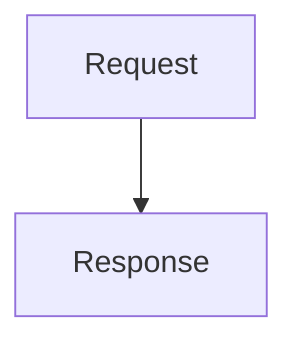

# Usage

Runnable examples of invoking Document Generator in different situations.

## Minimal document, no numbering or table of contents

`config.json` - every key is optional and falls back to a default when omitted (see
`Docs/Api.md`), so a config only needs to specify what differs from the default. `heading1`
through `heading6` already default to a sensible, decreasing bold size/spacing scale, so this
alone is enough to get a styled title and a styled `# Heading` in the body:

```json
{
  "title": ["My Document"]
}
```

```sh
BlueHeighliner.DocumentGenerator config.json input.md output.docx
```

## Numbered headings with a table of contents

Give two levels numbering, with the second level's number prefixed by the first's (`1.1`, `1.2`,
`2.1`, ...). Levels 1 and 2 already default to appearing in the table of contents page, so nothing
extra is needed for that part:

```json
{
  "title": ["Report"],
  "subtitle": ["Q3 2026"],
  "heading1": { "color": "#1F2937", "numbering": "decimal", "pageBreakAfter": true },
  "heading2": { "color": "#374151", "numbering": "decimal", "numberingPrefix": true },
  "header": { "left": ["Report - Q3 2026"] },
  "footer": { "pageNumbers": "center" }
}
```

`pageBreakAfter: true` on level 1 starts every top-level section on its own page. Opening the
resulting `output.docx` in Word will show placeholder text in the table of contents and page
number fields until they're updated (Word does this automatically on open, or via Ctrl+A then F9).

## Styling the cover page title and subtitle

`title` and `subtitle` take `size`/`bold`/`italic`/`color` styling alongside their `lines`. A
plain array of strings (as in the earlier examples) is shorthand for just `lines`, keeping every
other property at its default; write the full object form to customize the styling too:

```json
{
  "title": { "lines": ["Confidential Report"], "size": 44, "color": "#7C2D12" },
  "subtitle": { "lines": ["Internal Draft"], "italic": true }
}
```

## Header and footer stacking, alignment, and per-page-type lines

A header/footer's content is split into `left`/`center`/`right` line lists; lines at the same
index across them share a row (e.g. `left[0]` and `right[0]` render on the same line, on opposite
sides of the page). A header stacks top-down (`left[0]` etc. is the topmost row); a footer stacks
bottom-up (`left[0]` etc. is the row closest to the page's bottom edge). Each line is either a
plain string (shown on every page) or `{ "line": "...", "mode": "cover" | "body" }` to restrict it
to just the cover page or just non-cover pages. `pageNumbers` (`"none"` | `"left"` | `"center"` |
`"right"`, default `"none"`) both enables and aligns the page number, and - when not `"none"` - is
always row 0, ahead of every `left`/`center`/`right` row.

This puts a left-aligned company name and a right-aligned document title on the same header row,
adds a second header row with draft text shown only on the cover page, and right-aligns the page
number in the footer (which, being row 0 in a footer, ends up as the very last, bottommost line):

```json
{
  "header": {
    "left": ["Acme Corp", { "line": "DRAFT - not for distribution", "mode": "cover" }],
    "right": ["Quarterly Report"]
  },
  "footer": { "pageNumbers": "right" }
}
```

## Trimming the source to a fenced region

With `exclusion: true`, only the markdown between the first and last horizontal bar line is
rendered - useful when the source file also carries front matter or notes outside the document's
actual content:

```markdown
Draft notes for the author, not part of the document.

---

# Actual Document

This is the content that gets rendered.

---

TODO: still need to review the numbers in section 2.
```

Everything outside the `---` lines (and the lines themselves) is dropped before rendering.

## Diagrams, tables, and code blocks

These need no extra configuration - they're recognized from the markdown itself:

````markdown
| Metric | Value |
| --- | --- |
| Uptime | 99.9% |

```csharp
Console.WriteLine("rendered in a monospace font on a gray background");
```


````

The table becomes a document table, the ` ```csharp ` block becomes a shaded monospace paragraph,
and the ` ```mermaid ` block is rendered to a PNG (via the hosted mermaid.ink service) and embedded
as a picture.
