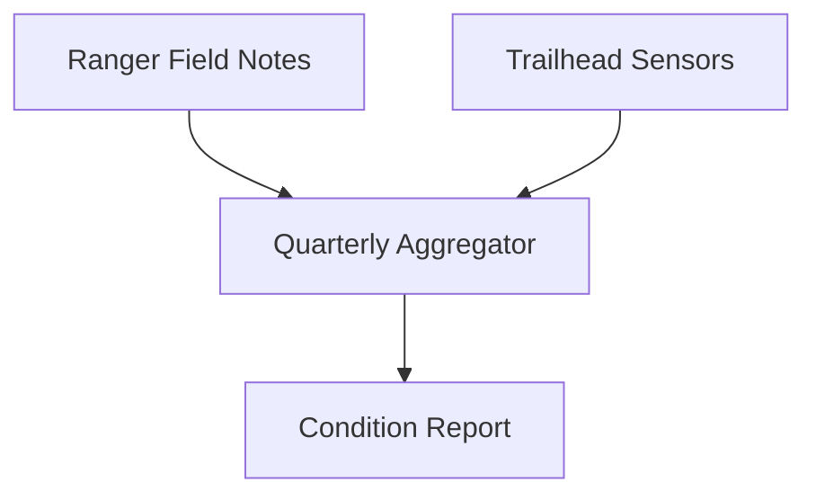

Reviewer note: confirm mileage figures with the survey team before final sign-off.

---

# Project Overview

The Blue Ridge Trail Network spans forty-two miles across six county parks. This report covers
trail conditions, maintenance activity, and recommended actions for the third quarter of 2026.

## Background

The network was last resurveyed in full two years ago. Since then, three new connector trails
have opened and storm damage has closed two segments for extended periods, prompting this
quarter's inspection.

### Site Selection Criteria

Segments were selected for inspection based on reported trail conditions, time since last
maintenance, and proximity to trailheads with the highest recorded foot traffic.

# Results

## Trail Conditions

| Segment | Length (mi) | Condition | Last Maintained |
| --- | --- | --- | --- |
| Ridge Loop | 8.2 | Good | 2026-04 |
| Overlook Spur | 3.1 | Fair | 2025-11 |
| Creekside Connector | 5.6 | Poor | 2024-09 |
| Summit Trail | 6.0 | Good | 2026-06 |

## Data Collection Pipeline

Condition ratings come from a combination of ranger field notes and trailhead sensor counters,
merged into a single quarterly report:



## Sample Sensor Reading

Trailhead sensors log a count and timestamp each time a hiker passes:

```
{"trailheadId": "CRK-04", "count": 1, "timestamp": "2026-07-14T08:32:00Z"}
```

## Recommended Actions

1. Reroute the Creekside Connector around the washed-out culvert before winter.
2. Schedule brush clearing on the Overlook Spur.
3. Re-blaze trail markers network-wide:
   - Priority segments first (Creekside Connector, Overlook Spur)
   - Remaining segments during the spring maintenance window

---

Second draft - awaiting sign-off from the trails committee before distribution.
